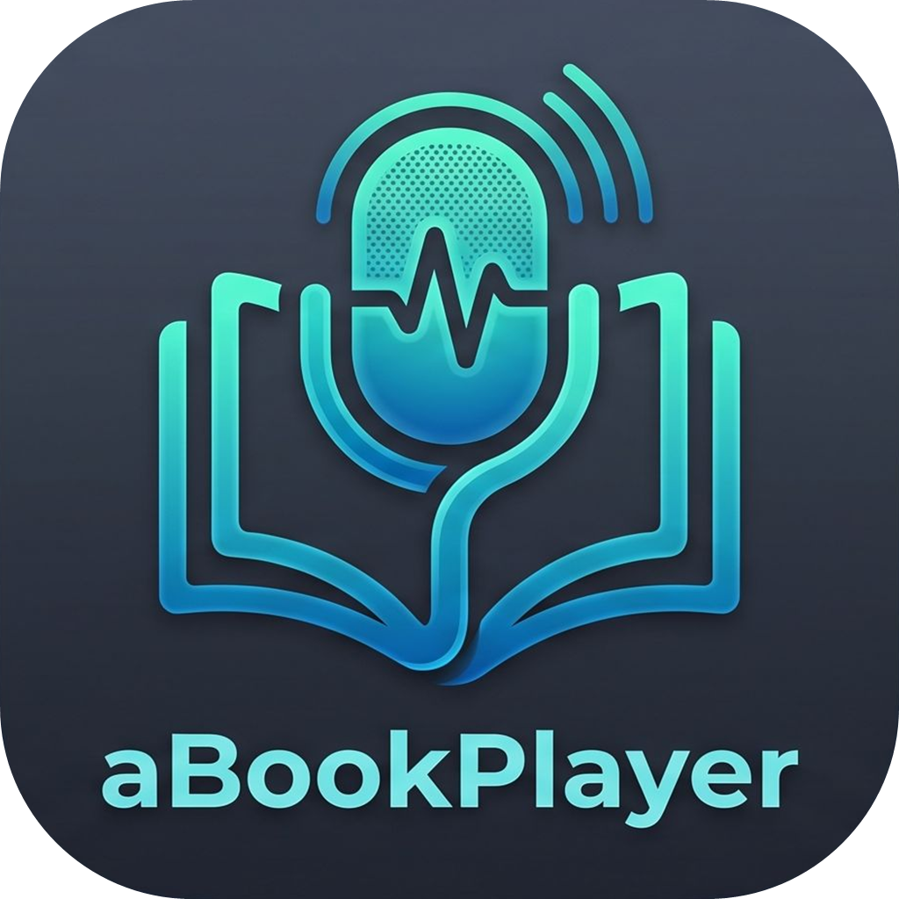

<p align="center"></p>

# aBookPlayer

A dark-themed Windows audiobook player with chapters, synchronized subtitles and local speech-to-text transcription.

<p align="center">
  <a href="docs/aBookPlayer-features.mp4"></a><br>
  <a href="docs/aBookPlayer-features.mp4">▶ Watch the feature video (58 s)</a>
</p>

## Features

- **Formats**: MP3, M4A, M4B, AAC, MP4, WMA, WAV, FLAC, AIFF, OGG
- **Books in several files**: a folder of chapter files (also split into "CD 1", "CD 2"… subfolders) plays as one book, with one chapter per file
- **Chapters**: read from ID3 (MP3), iTunes/QuickTime and Nero chapters (M4A/M4B), Vorbis comments (FLAC/OGG); chapter list, marks on the seek bar, previous/next chapter
- **Covers** from the file's tags or an image in its folder, shown next to the title, in the library and in Windows' media flyout
- **Library**: every book with its cover, author and progress; filters and search; scans your audiobook folders
- **Windows media controls**: title and cover in the volume/media flyout and on the lock screen; media keys and Bluetooth headset buttons work with the window in the background; play/pause and chapter buttons in the taskbar thumbnail
- **Bookmarks** with notes, shown on the seek bar; export them (with the words spoken) as Markdown
- **Smart rewind**: after a pause, playback resumes 5–30 s earlier depending on how long it was paused
- **Voice boost**: evens out the narrator's volume (quiet passages louder, loud ones softer)
- **Skip silences**: shortens the narrator's long pauses, with position and subtitles still exact
- **Sync between PCs** through a shared folder (OneDrive, Dropbox, a NAS): continue on another PC where you stopped
- **Subtitles**: `.srt` files kept in sync with the audio (an `.srt` with the same name loads automatically), adjustable delay, customizable font, color, background and position; click them to play/pause, right-click (or Ctrl+C) to copy the line on screen
- **Transcription**: creates a synchronized `.srt` (and optionally a `.txt` with chapter headings) using [whisper.cpp](https://github.com/ggerganov/whisper.cpp) via [Whisper.net](https://github.com/sandrohanea/whisper.net). Runs entirely on the PC; the model is downloaded once, on demand. Uses the graphics card through Vulkan when available (NVIDIA, AMD, Intel; GPU support is also downloaded once, on demand). Several books can be queued
- **Search in the subtitles** (Ctrl+F) and jump to where a phrase is spoken
- **Sentence by sentence**: repeat the sentence just heard, go to the previous/next one, loop one (handy with a language you are learning)
- **Chapters from the transcription**: a book without chapters gets the headings the narrator reads ("Chapter 12", "Prologue"…)
- **Audible libraries**: books exported from Audible with [Libation](https://getlibation.com/) or OpenAudible are recognized by their names and tags (title, series, ASIN), play chapter by chapter, find the subtitles the export left in their folder, and sync between PCs by ASIN (aBookPlayer itself does not sign in to Audible or remove DRM: see [Audible libraries](#audible-libraries))
- **Playback speed** 0.5×–2× without pitch change; subtitles and chapters stay in sync
- **Every book remembers** its position, subtitles and sync; **Recent books** menu
- **Sleep timer**: after 15–90 minutes or at the end of the chapter, with a fade-out
- **Speed per book**: every book keeps its own playback speed
- **Mini player** (Ctrl+M) always on top, and an optional icon in the notification area
- **Listening statistics**: time per day and per book, and when you will finish the current book at your pace
- **No standby while playing**, and optionally no screensaver or display off (Playback → Keep screen on while playing)
- Single window ("Open with" reuses it), drag & drop, keyboard shortcuts (F1)

## Audible libraries

aBookPlayer does **not** sign in to your Audible account and does **not** remove DRM. Audible has no public API for
third-party apps, and its `.aax`/`.aaxc` downloads are encrypted: opening them would mean circumventing a
protection measure, which the app deliberately does not do.

What it does instead is play the books you already exported to normal audio files with a tool that uses your own
account, such as [Libation](https://getlibation.com/) or [OpenAudible](https://openaudible.org/). Export once,
then add the export folder to the library (File → Library → Folders…). aBookPlayer understands what these tools
write:

| In the export | What aBookPlayer does |
|---|---|
| A folder per book, named `Title [ASIN]` | Shows the title without the long name and the ASIN code, and remembers the ASIN |
| One file per chapter (`… - 07 - Chapter 6.mp3`) | Plays them as one book, one chapter per file, named after the chapter |
| The **whole book** kept next to the chapter files (and the `.mp4` it came from) | Leaves it out: the chapter files are played, the book is not played a second time |
| Audible tags written by AAXClean (`AUDIBLE_ASIN`, `SERIES`, `PART`, `TIT3`, narrator) | Author, series ("Dungeon Crawler Carl, Book 1") in the library, and who reads the book under the title |
| The subtitles the exporter left in the folder | Loaded automatically (the per-chapter ones are not, they cover only part of the book) |
| The ASIN | Used to recognize the same book on another PC when syncing positions, even if it sits in another folder |

The library can list the books `By author` or `By series`, so a series stays together and in reading order.
Transcription (Ctrl+R) works on exported files like on any other book — they are ordinary `.mp3`/`.m4b` files.

## Requirements

- Windows 10/11 x64
- [.NET 10 SDK](https://dotnet.microsoft.com/download/dotnet/10.0) to build

## Build and run

```bash
dotnet run --project aBookPlayer.csproj
```

## Tests

```bash
dotnet test tests/aBookPlayer.Tests
```

They cover subtitles, metadata/chapter/cover readers (MP3, M4B, FLAC), time stretching and sync, channel downmixing, WAV decoding, books made of several files, Audible exports (Libation/OpenAudible names, tags and subtitles), the per-book history and bookmarks, smart rewind, sync between PCs, voice boost and the library scan. GitHub Actions builds and runs them on every push to `main` (`.github/workflows/ci.yml`).

## Installers

The installers are built with [Inno Setup](https://jrsoftware.org/isinfo.php) (6.3 or later):

```bash
powershell -ExecutionPolicy Bypass -File installer\build.ps1
```

This creates two setups in `installer\out`:

| Setup | Contents |
|---|---|
| `aBookPlayer-<version>-x64-setup.exe` | Self-contained, includes the .NET runtime |
| `aBookPlayer-<version>-x64-light-setup.exe` | Smaller, requires the .NET 10 Desktop Runtime |

The version comes from `<Version>` in `aBookPlayer.csproj`.

## Data locations

- Settings: `%APPDATA%\aBookPlayer\settings.json`
- Whisper models: `%LOCALAPPDATA%\aBookPlayer\models`
- GPU support (Vulkan build of whisper.cpp): `%LOCALAPPDATA%\aBookPlayer\gpu`
- Library cover thumbnails: `%LOCALAPPDATA%\aBookPlayer\covers`
- Synced positions: `<shared folder>\aBookPlayer sync\<PC name>.json` (one file per PC)

## Third-party components

NAudio, NAudio.Vorbis, NVorbis, Whisper.net and whisper.cpp, all under the MIT License.
